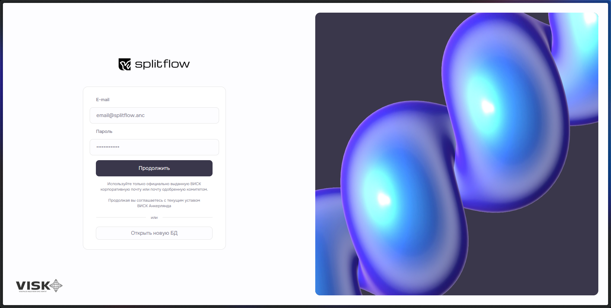
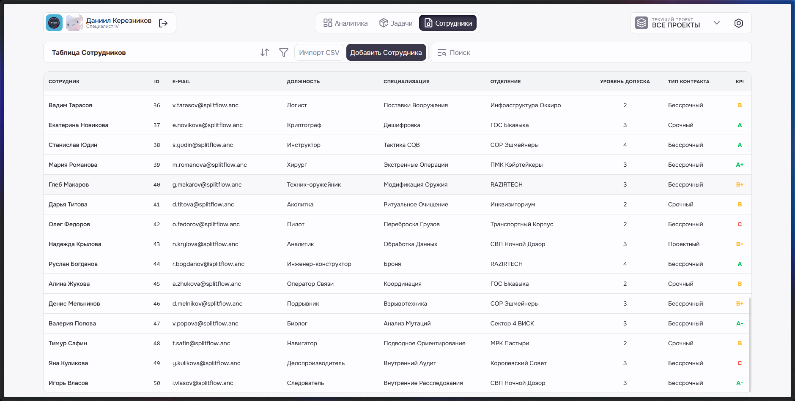
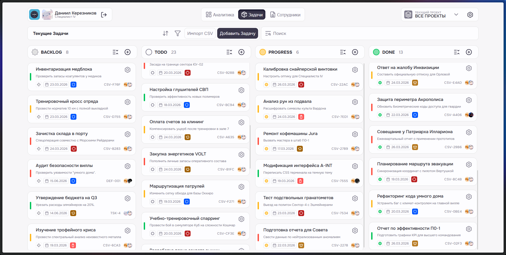

### Splitflow

Вымышленная CRM-система, созданная в рамках студенческих работ в исключительно любительских целях. (На данном этапе скорее всего очень много возомнивший о себе таск-трекер).

## Фичи

На данном этапе реализовано:

- Интеграция с локальной базой данных PostgreSQL
- CRUD операции над задачами, Drag&Drop интерфейс для изменения статуса.
- Разделение задач по проектам, приоритетам и исполнителям.
- Авторизация (без шифрования :D)
- Трекинг общего кол-ва задач, по типам
### Роадмап

- ~~Редизайн дэшборд меню. Кастомизация плиточного интерфейса~~ ✓
- ~~Настройка подключения к разным ДБ через интерфейс~~ ✓
- ~~Шифрование паролей~~ ✓ BCrypt
- ~~Редизайн карточек задач~~ ✓
- ~~Поиск по задачам~~ ✓
- ~~Фильтрация~~ ✓
- ~~Выбор исполнителя по поиску~~ ✓, но по списку
- ~~Редактирование статусов задач~~ ✓
- Перевод на другие языки

## 📸 Скриншоты 

