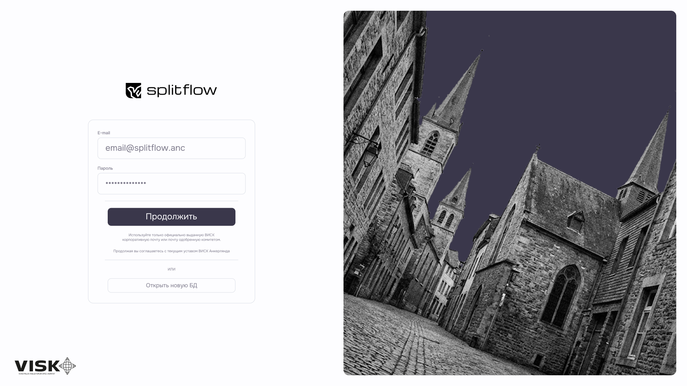
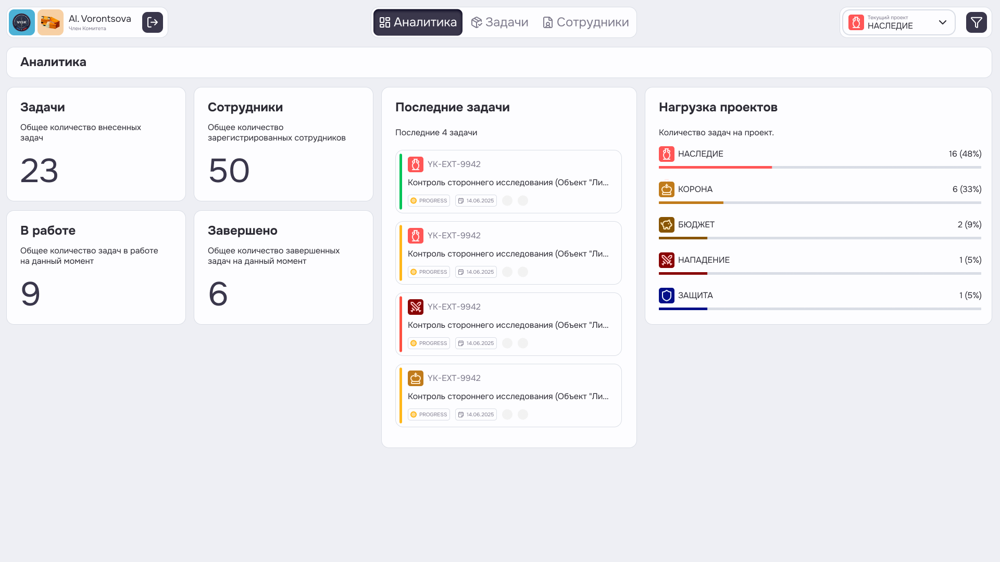
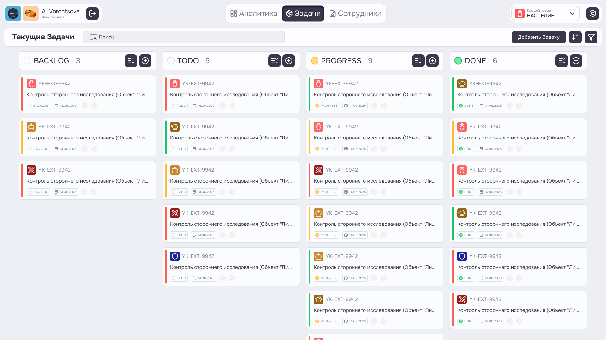
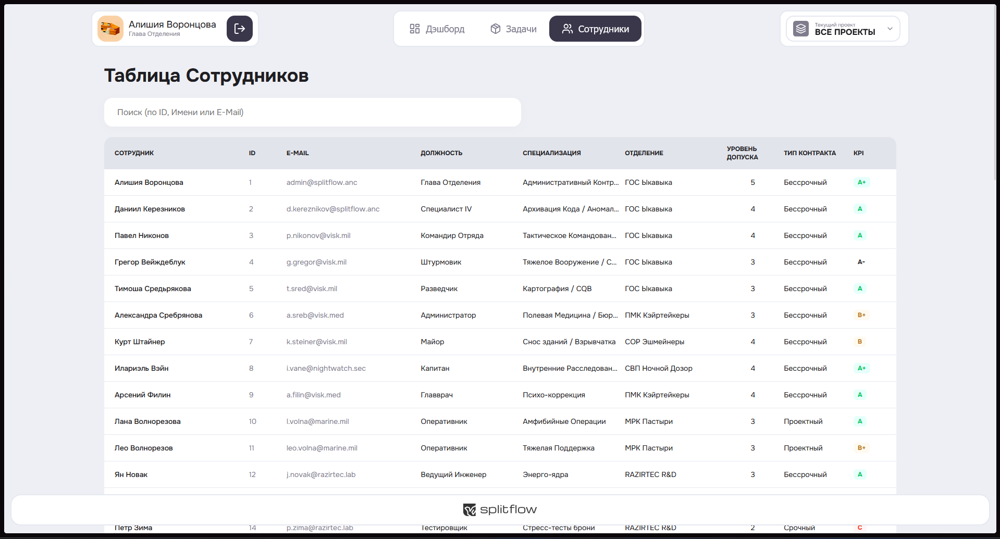

## 1 - Структура интерфейса (Экраны)

Интерфейс приложения построен по концепции **Island UI**, где основные блоки контента выделены визуально ("острова") на темном фоне. Навигация осуществляется через верхнюю панель (Header).

### 1.1 - Авторизация (Login Screen)

**Цель:** Ограничение доступа к системе. Вход только для авторизованных сотрудников.

**Элементы:**
*   Логотип Splitflow.
*   Поля ввода: `Email` (корпоративная почта), `Password`.
*   Кнопка действия: `Продолжить` (Primary Button).
*   Фоновое изображение замка/города (метафора защиты).
*   Ссылки на техподдержку/восстановление пароля (опционально).

---

### 1.2 - Главная панель (Dashboard)

**Цель:** Предоставить пользователю сводку по текущей активности и статусу проектов.
**Элементы:**
*   **KPI карточки:** Количество сотрудников (50), активных задач (41), завершенных (11).
*   **График загрузки:** Прогресс-бары по проектам ("Наследие", "Экономика", "Защита").
*   **Список последних задач:** Таблица с последними 5 задачами (статус, дедлайн).

---

### 1.3 - Канбан-доска (Tasks Board)
**Цель:** Основное рабочее пространство для управления задачами.
**Элементы:**
*   **Колонки:** `TODO` (К выполнению), `PROGRESS` (В работе), `DONE` (Завершено).
*   **Карточка задачи:**
    *   Заголовок задачи.
    *   Цветной индикатор приоритета (Красный/Желтый/Зеленый).
    *   Иконка проекта.
    *   Аватар исполнителя.
    *   Дата дедлайна.
*   **Фильтры:** Выпадающий список проектов в шапке (глобальный фильтр).
*   **Действия:** Кнопка `+` для создания новой задачи.

---

### 1.4 - Список сотрудников (Employees)
**Цель:** Справочник контактов и информация о команде.
**Элементы:**
*   **Таблица:** ID, Фото, Имя, Email, Должность, Специализация, Отдел, Уровень допуска, Тип контракта, KPI.
*   **Поиск:** Поле ввода для фильтрации по имени/ID/Email.

---

## 2 - Состояния UI (Feedback)

Система должна реагировать на действия пользователя и сетевые задержки.

*   **Loading (Загрузка):** При переходе между вкладками или отправке формы (например, создание задачи) отображается спиннер или скелетон (placeholder). Кнопки блокируются (`disabled`).
*   **Success (Успех):**
    *   После создания задачи модальное окно закрывается, список обновляется.
    *   После успешного входа происходит редирект на Dashboard.
*   **Error (Ошибка):**
    *   Всплывающее уведомление (Toast) с текстом ошибки (например, "Неверный логин/пароль", "Сервер недоступен").
    *   Подсветка полей ввода красным цветом при валидации.
*   **Empty (Пусто):**
    *   Если задач нет: отображается сообщение "Задач пока нет, создайте новую".
    *   Если поиск не дал результатов: "Ничего не найдено".

---

## 3 - Пользовательские сценарии (User Stories)

### Сценарий 1: Создание срочной задачи
1.  **Пользователь (Супервайзер)** авторизуется в системе.
2.  Переходит на вкладку **Задачи**.
3.  Нажимает кнопку `+` (Добавить задачу).
4.  Открывается модальное окно.
5.  Пользователь вводит:
    *   Название: "Исправить баг в API".
    *   Приоритет: "Высокий" (High).
    *   Дедлайн: "18.02.2026".
    *   Исполнитель: Выбирает из списка (ID 5).
6.  Нажимает `Создать`.
7.  **Результат:** Окно закрывается, новая карточка появляется в колонке `TODO` с красной меткой.

### Сценарий 2: Выполнение задачи (Смена статуса)
1.  **Пользователь (Разработчик)** заходит в систему.
2.  Видит задачу "Исправить баг в API" в колонке `TODO`.
3.  Нажимает на карточку (или перетаскивает её) в колонку `PROGRESS`.
4.  **Результат:** Статус задачи обновляется, цвет индикатора меняется на желтый (в работе).
5.  После завершения работы переносит карточку в `DONE`.
6.  **Результат:** Задача помечается выполненной (зеленый индикатор).

### Сценарий 3: Поиск сотрудника по отделу
1.  **Пользователь (HR)** переходит на вкладку **Сотрудники**.
2.  В поле поиска вводит название отдела "Резерв".
3.  **Результат:** Таблица мгновенно фильтруется, показывая только сотрудников этого отдела.
4.  Пользователь кликает на строку сотрудника, чтобы скопировать его Email.

---

## 4 - Типовые ошибки и сообщения

| Ситуация | Сообщение пользователю | Тип UI |
| :--- | :--- | :--- |
| Неверный пароль | "Ошибка авторизации: Неверный логин или пароль." | Алерт / Текст под полем |
| Сервер недоступен | "Ошибка сети. Попробуйте повторить запрос позже." | Toast (всплывающее) |
| Пустое поле при создании | "Поле 'Название задачи' обязательно для заполнения." | Подсветка поля |
| Нет прав на действие | "У вас недостаточно прав для удаления этой задачи." | Toast (всплывающее) |
| Таймаут соединения | "Время ожидания истекло. Проверьте интернет-соединение." | Toast (всплывающее) |