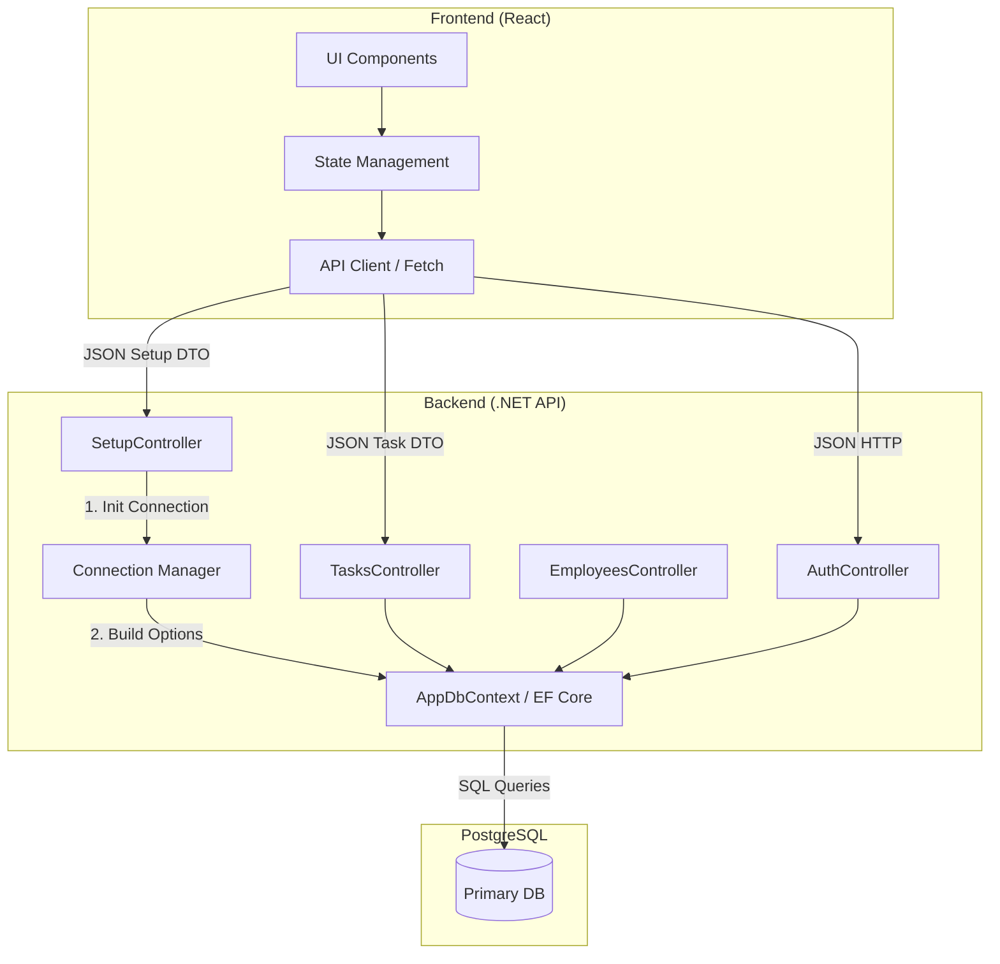

## Диаграмма компонентов (Mermaid)

**Setup Flow:** `SetupController` - это входная точка для инициализации. 
Он взаимодействует с `Connection Manager` (логический компонент), чтобы создать строку подключения и применить её к `AppDbContext` в рантайме.

**Standard Flow:** Остальные контроллеры (`Tasks`, `Employees`) работают через уже настроенный `AppDbContext`.