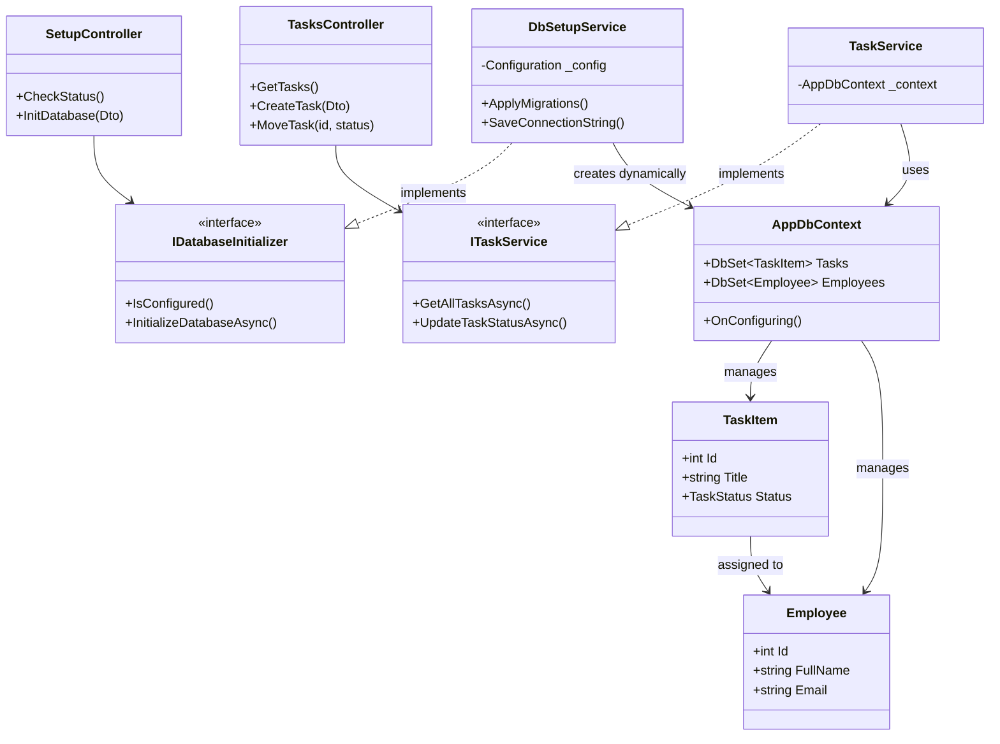

Структура бэкенда. <!-- (рендер mermaid) -->

```mermaid
classDiagram
    %% Controllers
    class SetupController {
        +CheckStatus()
        +InitDatabase(Dto)
    }
    class TasksController {
        +GetTasks()
        +CreateTask(Dto)
        +MoveTask(id, status)
    }

    %% Interfaces
    class IDatabaseInitializer {
        <<interface>>
        +IsConfigured()
        +InitializeDatabaseAsync()
    }
    class ITaskService {
        <<interface>>
        +GetAllTasksAsync()
        +UpdateTaskStatusAsync()
    }

    %% Implementations
    class DbSetupService {
        -Configuration _config
        +ApplyMigrations()
        +SaveConnectionString()
    }
    class TaskService {
        -AppDbContext _context
    }

    %% Data Access
    class AppDbContext {
        +DbSet~TaskItem~ Tasks
        +DbSet~Employee~ Employees
        +OnConfiguring()
    }

    %% Domain Models
    class TaskItem {
        +int Id
        +string Title
        +TaskStatus Status
    }
    class Employee {
        +int Id
        +string FullName
        +string Email
    }

    %% Relationships
    SetupController --> IDatabaseInitializer
    TasksController --> ITaskService
    
    DbSetupService ..|> IDatabaseInitializer : implements
    TaskService ..|> ITaskService : implements
    
    TaskService --> AppDbContext : uses
    DbSetupService --> AppDbContext : creates dynamically
    
    AppDbContext --> TaskItem : manages
    AppDbContext --> Employee : manages
    TaskItem --> Employee : assigned to
```

